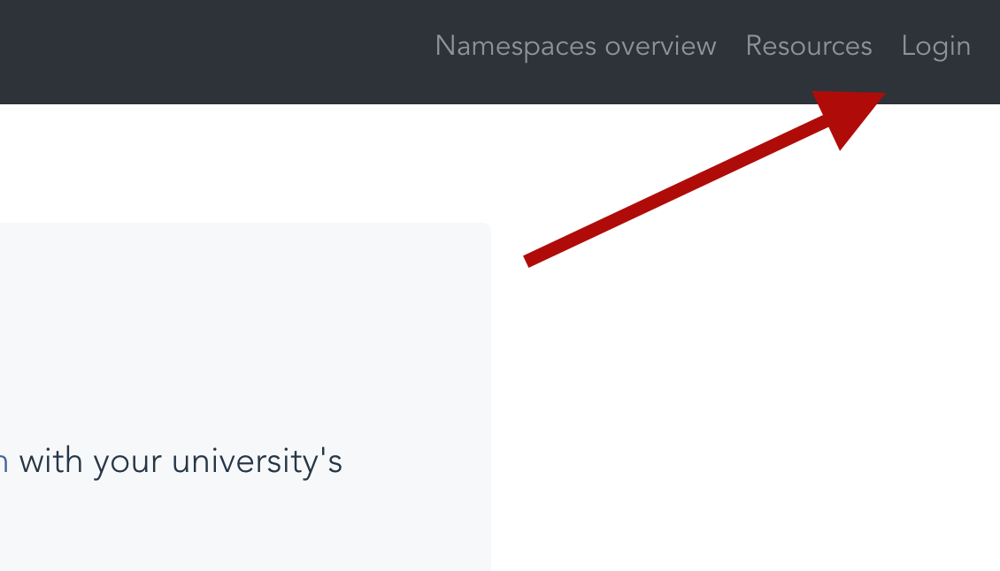
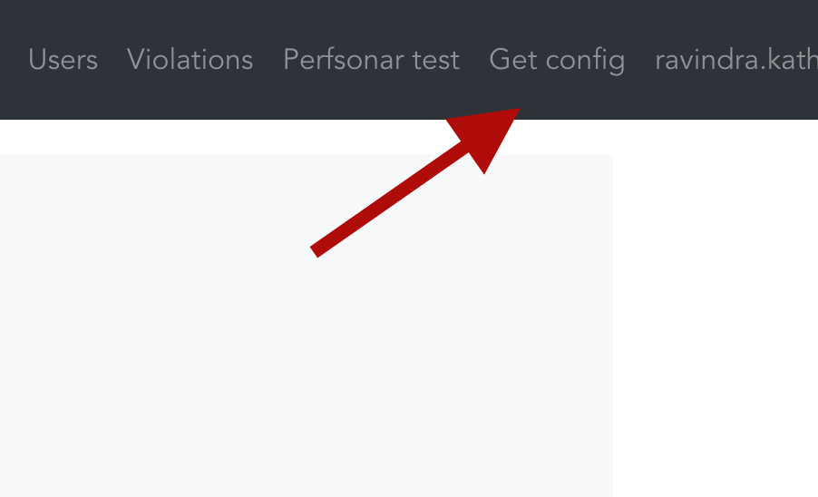
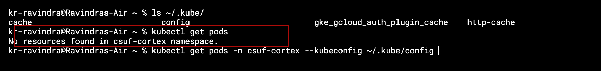
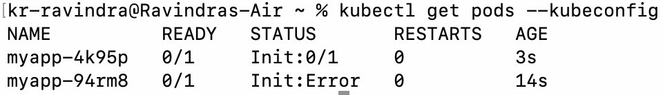

# nautilus-nrp-guide
This guide helps CSUF users to onboard and utilise GPUs at https://portal.nrp-nautilus.io/

## Pre-requisite tool - kubectl

#### For Windows

1. Go to this [https://dl.k8s.io/release/v1.29.3/bin/windows/amd64/kubectl.exe](https://dl.k8s.io/release/v1.29.3/bin/windows/amd64/kubectl.exe). 
2. Copy the downloaded file `kubectl.exe` to Desktop or anywhere you feel convenient.

#### For MacOS

1. Open terminal and run 
```
brew install kubectl
```
If you don't have brew - `/bin/bash -c "$(curl -fsSL https://raw.githubusercontent.com/Homebrew/install/HEAD/install.sh)"` run this in your terminal and then the above command.

#### For Linux

1. Open terminal and run 
```
sudo apt-get update \
sudo apt-get install -y apt-transport-https ca-certificates curl \
curl -fsSL https://pkgs.k8s.io/core:/stable:/v1.29/deb/Release.key | sudo gpg --dearmor -o /etc/apt/keyrings/kubernetes-apt-keyring.gpg \
sudo chmod 644 /etc/apt/keyrings/kubernetes-apt-keyring.gpg \
echo 'deb [signed-by=/etc/apt/keyrings/kubernetes-apt-keyring.gpg] https://pkgs.k8s.io/core:/stable:/v1.29/deb/ /' | sudo tee /etc/apt/sources.list.d/kubernetes.list \
sudo chmod 644 /etc/apt/sources.list.d/kubernetes.list \
sudo apt-get update \
sudo apt-get install -y kubectl
```

> Refer [https://kubernetes.io/docs/tasks/tools/](https://kubernetes.io/docs/tasks/tools/) for official guide

## Getting Started

1. Login [https://portal.nrp-nautilus.io/](https://portal.nrp-nautilus.io/ )



2. Download the config using this button, once you login.

-  place this file in your HOME directory at a new folder named `.kube` ~[optional]~
For Windows - `C:\\Users\USERNAME\.kube\config`
For Mac/Linux - `~/.kube/config`



3. Let professor know your group/individual name and members of your team (email ids) to get access to the cluster.


## Accessing Cluster and Running Workloads

1. Open Command Prompt (For Windows)/ Terminal (Mac/Linux) and try to `get pods` using 

```kubectl get pods ```


At this point if you get an error msg reading `Forbidden`; you are still guest user. Make sure you completed [3 step in Getting Started section](#getting-started).

- if you get access denied/connection refused use below command:
```kubectl get pods -n NAMESPACE --kubeconfig PATH_TO_DOWNLOADED_CONFIG_FILE```

## Running your first test job application

1. Create a file called `firstjob.yaml` in your workspace with following content:
```
apiVersion: batch/v1
kind: Job
metadata:
  name: demo-app
spec:
  template:
    spec:
      containers:
      - name: demo-app
        image: gitlab-registry.nrp-nautilus.io/prp/jupyter-stack/prp:latest
        command:
        - "python"
        args:
        - "/opt/repo/REPONAME/PYTHON_FILE"
        volumeMounts:
        - name: git-repo
          mountPath: /opt/repo
        resources:
          limits:
            memory: 8Gi
            cpu: "4"
            nvidia.com/gpu: "1"
          requests:
            memory: 4Gi
            cpu: "1"
            nvidia.com/gpu: "1"    
      initContainers:
      - name: init-clone-repo
        image: alpine/git
        args:
          - clone
          - --single-branch
          - https://github.com/USERNAME/REPONAME.git
          - /opt/repo/nautilus
        volumeMounts:
          - name: git-repo
            mountPath: /opt/repo
      volumes:
      - name: git-repo
        emptyDir: {}
      restartPolicy: Never
  backoffLimit: 5
```

2. To apply this on cluster, run `kubectl apply -f /pathto/firstjob.yaml -n NAMESPACE --kubeconfig /path/to/config.yaml`

- Sample Output on `kubectl get pods`




## To be continued..

Well now, you are good to run your wokloads as jobs/batch jobs on the kubernetes cluster. I will come back with detailed tutorial on deploying workloads soon.

You can also refer documentation for [https://docs.nationalresearchplatform.org/userdocs/running/ ](https://docs.nationalresearchplatform.org/userdocs/running/)
